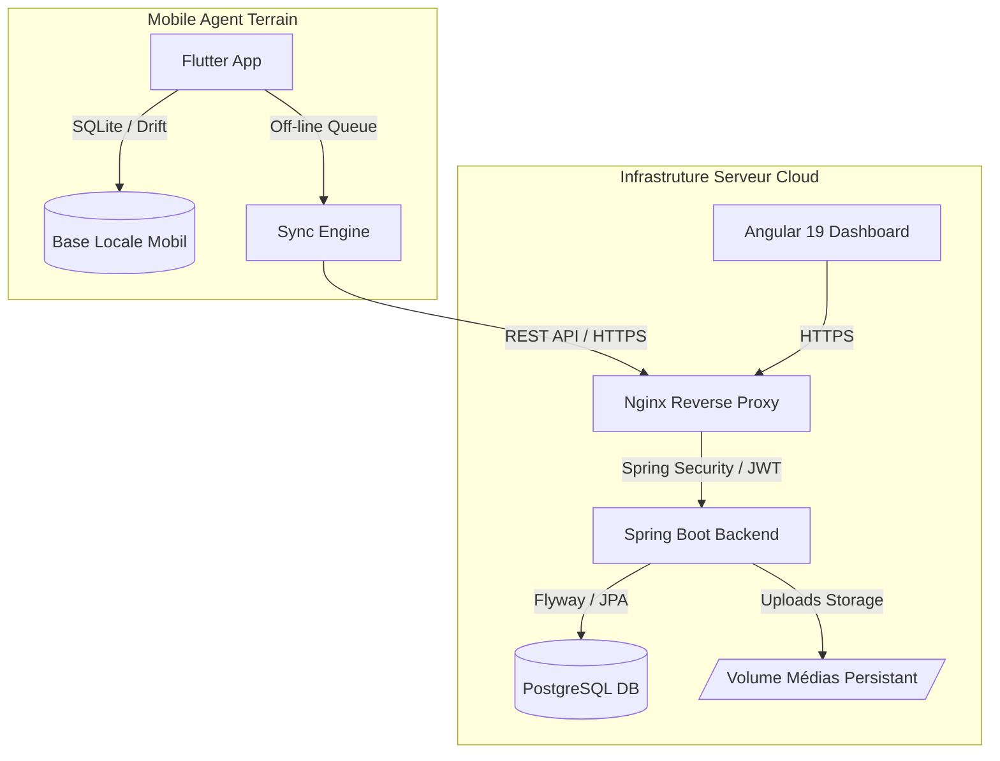

# 📌 CollectPro — Plateforme Enterprise de Collecte de Données Terrain Offline-First

[](https://github.com/Diakite-Moussa/CollectPro)
[](https://spring.io/projects/spring-boot)
[](https://angular.dev/)
[](https://flutter.dev/)
[](https://www.postgresql.org/)
[]()

**CollectPro** est une solution logicielle d'entreprise conçue pour la collecte de données sur le terrain dans des environnements connectés ou à faible connectivité réseau (ONG, enquêtes médicales, audits industriels, recensements).

La plateforme repose sur une architecture **Offline-First** : les agents saisissent et géolocalisent leurs données localement sur leur terminal mobile. Dès le rétablissement d'une connexion réseau, les soumissions sont automatiquement synchronisées vers le serveur central, soumises au workflow de validation des superviseurs et auditées en temps réel.

---

## 🌟 Fonctionnalités Clés

### 📱 Application Mobile (Flutter)
- **Offline-First Resilience** : Saisie 100% hors-ligne grâce à une base de données embarquée **SQLite (Drift)**.
- **Synchronisation Intelligente** : Détection réseau automatique, résolution de conflits, dédoublonnage et journalisation des tentatives (`POST /sync-logs`).
- **Édition & Correction Locale** : Réédition des soumissions en brouillon (`DRAFT`) ou en échec (`SYNC_FAILED`) avant nouvel envoi.
- **Collecte Multimédia & GPS** : Capture précise des coordonnées GPS (Geolocator), prises de photos justificatives (appareil photo / galerie) et pièces jointes documentaires.
- **Sécurité Mobile** : Stockage chiffré des jetons d'accès (`flutter_secure_storage`) et rafraîchissement automatique des sessions JWT.

### 📊 Dashboard Web Administration & Supervision (Angular 19)
- **Constructeur Dynamique de Formulaires** : Création, modélisation visuelle et versionnement des formulaires d'enquête.
- **Workflow de Supervision (RF-012)** : Validation ou rejet motivé des collectes reçues avec historisation des décisions et commentaires.
- **Journal d'Audit Global (`audit_logs`)** : Traçabilité complète des actions sensibles (créations de comptes, modifications d'organisations, validations, réinitialisations de mots de passe).
- **Statistiques & KPI en Temps Réel** : Tableau de bord unifié par rôle (`SUPER_ADMIN`, `ADMIN_PRINCIPAL`, `SUPERVISOR`).
- **Gestion Multi-Tenant** : Isolation hermétique des données et utilisateurs par organisation.

### ⚙️ Backend Core API (Spring Boot 3 / Java 17+)
- **Sécurité RBAC & JWT** : Authentification stateless avec rotation des Refresh Tokens et contrôle d'accès fin par SpEL `@PreAuthorize`.
- **Migrations de Base de Données (Flyway)** : Évolutions de schéma automatisées et versionnées (`V1` à `V4`).
- **Pattern Journal d'Audit Isolation (`REQUIRES_NEW`)** : Enregistrement d'audit indépendant empêchant l'annulation des logs en cas d'incident métier.
- **Haut Niveau de Robustesse** : Traitement des pièces jointes multipart, sécurisation CORS externalisée et déploiement *Fail-Fast* en production.

---

## 🏗️ Architecture du Système



---

## 🔐 Matrice des Rôles & Permissions (RBAC)

| Rôle | Périmètre d'accès | Fonctionnalités principales |
| :--- | :--- | :--- |
| 🛡️ **Super Admin** | Global (Plateforme) | Gestion des organisations, création des admins principaux, statistiques globales, audit trail complet. |
| 🏢 **Admin Principal** | Organisation | Gestion des utilisateurs de l'org, création des formulaires, affectation superviseurs-agents, audit org. |
| 👤 **Admin Secondaire** | Organisation (Restreint) | Gestion déléguée des utilisateurs et formulaires selon permissions attribuées. |
| 👁️ **Superviseur** | Équipe d'Agents | Consultation des collectes de l'équipe, **Validation/Rejet des collectes (RF-012)**, suivi d'activité. |
| 📲 **Agent Terrain** | Personnel | Saisie offline, capture GPS/Photos, synchronisation vers le serveur. |

---

## 📁 Structure du Projet

```text
CollectPro/
├── backend/                  # API REST Spring Boot 3 (Java 17/21, PostgreSQL, Flyway)
│   ├── src/main/java/        # Modèle, Contrôleurs, Services, Sécurité JWT & Audit
│   ├── src/main/resources/   # App YML (dev/prod), Migrations Flyway db/migration (V1..V4)
│   └── Dockerfile            # Image Docker multi-stage pour le backend
├── dashboard/                # Application Web Angular 19 (Angular Material, Signals, RxJS)
│   ├── src/app/core/         # Services HTTP, Modèles, Intercepteurs JWT
│   ├── src/app/features/     # Composants d'écrans (Form Builder, Audit Logs, Collectes)
│   └── src/environments/     # Configurations d'environnements (environment.ts / environment.prod.ts)
├── mobile/                   # Application Mobile Flutter 3 (Android & iOS)
│   ├── lib/data/local/       # SQLite & Accessors DAO (Drift)
│   ├── lib/screens/          # Écrans de saisie, de consultation et de synchro
│   └── lib/services/         # Client Dio, Moteur de synchro, Géolocalisation & Médias
├── nginx/                    # Reverse Proxy Nginx (SSL Let's Encrypt, CORS, Router)
├── scripts/                  # Scripts d'infrastructure (backup_db.sh, rétention)
├── docker-compose.prod.yml   # Déploiement multi-conteneurs de production
└── README.md
```

---

## 🚀 Démarrage Rapide (Environnement de Développement)

### 1. Prérequis
- **Java 17+** & **Maven 3.9+**
- **Node.js 18+** & **Angular CLI 19**
- **Flutter SDK 3.22+**
- **PostgreSQL 16** (ou Docker)

### 2. Backend Spring Boot
```bash
cd backend
mvn spring-boot:run -Dspring-boot.run.profiles=dev
```
*L'API sera disponible sur `http://localhost:8080`.*

### 3. Dashboard Web Angular
```bash
cd dashboard
npm install
ng serve
```
*Le dashboard sera accessible sur `http://localhost:4200`.*

### 4. Application Mobile Flutter
```bash
cd mobile
flutter pub get
flutter run
```

---

## 🐳 Déploiement en Production

### 1. Variables d'Environnement
Copiez le modèle de production et renseignez vos secrets réels :
```bash
cp .env.prod.example .env
nano .env
```

### 2. Lancement par Docker Compose
```bash
docker-compose -f docker-compose.prod.yml --env-file .env up -d --build
```

### 3. Build Release Mobile (Android AppBundle)
```bash
cd mobile
flutter build appbundle --release --dart-define=API_URL=https://api.collectpro.com
```
*Fichier produit : `mobile/build/app/outputs/bundle/release/app-release.aab`.*

---

## 🧪 Suite de Tests Automatisés

Le projet inclut une couverture de tests complète sur les trois briques :

```bash
# Tests unitaires & d'intégration Backend Spring Boot
cd backend && mvn test

# Tests DAO SQLite / Drift Mobile Flutter
cd mobile && flutter test

# Tests unitaires Frontend Angular (Vitest / Karma)
cd dashboard && npm test -- --watch=false
```

---

## 📄 Licence & Droits

Propriété exclusive du projet **CollectPro**. Tous droits réservés.
